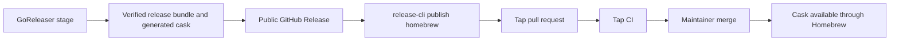

# Homebrew Support Plan

## Decision

Build Homebrew support around a protected tap pull request:

1. GoReleaser renders the cask but never uploads it.
2. The GitHub Release becomes public.
3. `release-cli publish homebrew` opens a pull request in the tap.
4. Tap CI validates the cask without secrets.
5. A maintainer merges the pull request. That merge publishes the cask.

Use one organization tap, `meigma/homebrew-tap`, while keeping the publisher's tap target configurable.

For casks, no post-merge publication workflow is required. The tap's default branch is the published state. A push-to-default-branch workflow may verify the merged cask, but it does not publish another artifact.

## Proven assumptions

A local snapshot probe against the repository's current GoReleaser configuration established these facts:

- `homebrew_casks` with `skip_upload: true` runs under the production-compatible `--skip=publish` path.
- GoReleaser writes `dist/homebrew/Casks/<token>.rb`.
- The generated cask contains macOS and Linux URLs and SHA-256 values for `amd64` and `arm64` archives.
- GoReleaser can remain the cask renderer; the CLI does not need to generate Ruby.

Use `homebrew_casks`, not GoReleaser's deprecated `brews` formula publisher. This channel distributes the exact prebuilt release archives rather than rebuilding the project from source inside Homebrew.

## Release flow



The GitHub Release is authoritative. Homebrew publication is eventually consistent with it. If pull-request creation fails after the release becomes public, the release remains public and the release workflow fails. A rerun must reconcile the existing tap branch, pull request, or merged cask without overwriting unknown state.

## GoReleaser configuration

Each producer declares its cask metadata in `.goreleaser.yaml` and disables GoReleaser's uploader:

```yaml
homebrew_casks:
  - name: meigma-release-cli
    ids:
      - release-cli
    binaries:
      - release-cli
    repository:
      owner: meigma
      name: homebrew-tap
    homepage: https://github.com/meigma/release
    description: Release automation for Meigma projects
    license: LicenseRef-Proprietary
    skip_upload: true
```

The cask token should be globally unique. Prefer an organization-prefixed token such as `meigma-release-cli`; the installed executable may remain `release-cli`.

Carry the generated cask in the authoritative Actions artifact so the publisher consumes the exact output of the release build. Do not add the cask to the GitHub Release's signed payload set. It is a reviewable tap control document, not a released binary.

## CLI commands

### Initialize a tap scaffold

```text
release-cli init homebrew-tap \
  --tap meigma/homebrew-tap \
  --output ./homebrew-tap
```

The first version is local and deterministic:

- Write a cask-only tap scaffold.
- Refuse a conflicting or nonempty output directory.
- Generate `README.md`, `.github/workflows/casks.yml`, and `.github/dependabot.yml`.
- Pin the managed reusable tap workflow to the CLI's source commit.
- Use the existing `release.dev/result/v1` envelope under `--json`.
- Perform no network requests and require no credential.

Do not make the initial command create the GitHub repository, configure rulesets, or modify the GitHub App installation. Those operations require broad organization-administration permissions. Create and push the rendered repository with the standard GitHub CLI command:

```text
gh repo create meigma/homebrew-tap --public --source ./homebrew-tap --push
```

Do not copy the official `brew tap-new` scaffold verbatim. Its generated publication path is designed for formula bottles and includes `brew pr-pull` machinery that a cask-only tap does not need.

### Publish a cask update

```text
release-cli publish homebrew \
  --dist dist \
  --tap meigma/homebrew-tap \
  --cask meigma-release-cli \
  --json
```

Inputs:

- `--dist`: authoritative release artifact directory.
- `--tap`: target `owner/repository`.
- `--cask`: expected cask token and generated filename.
- `RELEASE_APP_TOKEN`: GitHub App installation token; never accept it as a flag.
- `GITHUB_REPOSITORY`, `GITHUB_REF_NAME`, and `GITHUB_SHA`: source release identity.

A successful JSON result reports the tap, cask, publication branch, pull-request URL, and reconciled state. Expected states are `created`, `open`, and `published`.

The publication engine must:

1. Open the cask through a confined distribution root.
2. Require the expected regular, nonempty `homebrew/Casks/<token>.rb` file.
3. Read the tap's base branch and current cask.
4. Return `published` when the base branch already contains the exact cask.
5. Fail when the same version exists with different content.
6. Return an exact existing open pull request when its branch and content match.
7. Refuse an existing publication branch with unexpected content.
8. Create one commit that changes only `Casks/<token>.rb`.
9. Create a pull request without enabling auto-merge.
10. Return the final URL and state.

Never force-push, write directly to the tap's default branch, delete unexpected files, or overwrite an unknown publication branch.

Keep the state machine in a side-effect-free `internal/stage/pubbrew` package. Put GitHub repository mutation and pull-request operations behind narrow ports with focused `go-github` adapters. The engine, not the adapters, owns reconciliation and retry decisions.

## Managed workflows

### Producer-side publisher

Add `.github/workflows/publish-homebrew.yml` as a reusable workflow. It must:

- Run after the GitHub Release publisher succeeds and leaves the release public.
- Download and verify the authoritative release artifact.
- Verify the signed release bundle again.
- Mint a GitHub App installation token scoped to the tap repository.
- Request only `contents: write` and `pull_requests: write` for that token.
- Run `release-cli publish homebrew`.
- Fail when publication cannot be reconciled.

The release orchestration should expose Homebrew as an optional channel. A disabled Homebrew channel must not require tap credentials or create a tap pull request.

### Tap-side validation

The tap commits a small caller workflow that invokes a SHA-pinned reusable workflow from `meigma/release`, for example:

```yaml
jobs:
  casks:
    uses: meigma/release/.github/workflows/homebrew-tap-ci.yml@<full-sha>
```

The managed reusable workflow must:

- Run for pull requests that change `Casks/**`.
- Use no secrets and read-only repository permissions.
- Pin `Homebrew/actions/setup-homebrew` to a full commit SHA.
- Run `brew style --cask`.
- Run `brew audit --new --cask`.
- Install and uninstall each changed cask.
- Exercise macOS arm64 and Linux initially.
- Add Intel macOS coverage only when its larger-runner cost is justified.
- Optionally repeat validation after a push to the default branch.

Protect the tap's default branch with the cask workflow as a required check. The release App may create branches and pull requests but must not bypass the protected default branch. The tap repository therefore remains a separate approval boundary if a producer repository is compromised.

## Delivery slices

### Slice 0: tap rehearsal

- Create a disposable cask-only tap manually.
- Add a GoReleaser-generated cask through a pull request.
- Audit, install, uninstall, merge, and install from the merged tap.
- Prove that an incorrect checksum and unavailable URL fail.
- Confirm the current trust behavior for a non-official tap.

Acceptance: a real release archive installs from the merged tap, and the two negative mutations fail before merge.

### Slice 1: managed tap CI

- Implement `homebrew-tap-ci.yml`.
- Call it from the disposable tap.
- Prove successful and failing cask pull requests.
- Establish the exact required-check name.

Acceptance: the tap can protect its default branch with one stable, secret-free required check.

### Slice 2: publisher

- Add the `pubbrew` domain engine.
- Add GitHub tap and pull-request adapters.
- Add `publish homebrew`.
- Exercise create, rerun, existing-open-PR, already-merged, conflicting-branch, and same-version/different-content behavior against the disposable tap.

Acceptance: every rerun converges or fails on an explicit conflict; no path writes directly to the default branch.

### Slice 3: producer integration

- Add optional Homebrew inputs to the release orchestration.
- Carry the generated cask in the authoritative Actions artifact.
- Run `publish-homebrew.yml` after the public GitHub Release.
- Rehearse with the channel enabled and disabled.

Acceptance: an enabled release opens one valid tap pull request after publication; a disabled release needs no tap credential and performs no tap mutation.

### Slice 4: initializer

- Codify the proven tap layout in `init homebrew-tap`.
- Compare its output with the successfully rehearsed tap.
- Document repository creation, branch protection, and App-installation steps.

Acceptance: the initializer reproduces the proven scaffold without network access or ambient credentials.

## Risks and constraints

- GitNexus rates `NewRootCommand` as HIGH impact: 23 direct and 125 total indexed dependents. LSP confirms 24 references, mostly command test harnesses. Keep root wiring changes small and run all changed command contracts.
- The GitHub App must be installed on the tap repository. A selected-repository installation may require an organization owner to add it manually.
- Pull-request creation occurs after irreversible GitHub Release publication. Preserve explicit eventual-consistency and reconciliation behavior.
- Do not adopt GoReleaser's built-in pull-request publisher. Its current documentation states that pull-request publication errors may be logged without failing the release pipeline, which conflicts with this repository's fail-closed publication model.
- Do not add formula support in the first implementation. Formulae build from source and create a separate provenance contract from the exact released binary archives.

## Sources

- [Homebrew: How to Create and Maintain a Tap](https://docs.brew.sh/How-to-Create-and-Maintain-a-Tap)
- [Homebrew: Adding Software to Homebrew](https://docs.brew.sh/Adding-Software-to-Homebrew)
- [GoReleaser: Homebrew Casks](https://goreleaser.com/customization/publish/homebrew_casks/)
- [Homebrew Actions](https://github.com/Homebrew/actions)
